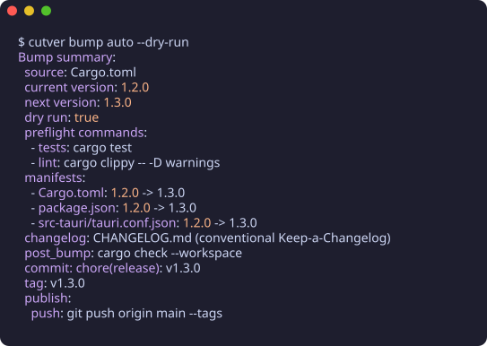

<div align="center">

# cutver

**Cut a release. Bump SemVer. Every project, every language.**

[](https://github.com/cutver/cutver/actions/workflows/ci.yml)
[](https://github.com/cutver/cutver/actions/workflows/release.yml)
[](https://github.com/cutver/cutver/releases)
[](https://github.com/cutver/cutver/releases)
[](https://crates.io/crates/cutver)
[](LICENSE)

<br/>

<p align="center">
  
</p>

</div>

---

`cutver` is a standalone, format-preserving release engine written in Rust. It synchronizes version numbers across any set of manifests, runs your project's verification pipeline with process-tree timeouts, updates structured changelogs with dynamic MiniJinja templating, commits, tags, and publishes — all driven by one declarative `cutver.toml` configuration.

No Node.js runtime. No heavyweight CI dependencies. No broken formatting or stripped comments.

---

## Why cutver?

| Principle | Guarantee |
| :--- | :--- |
| **Universal & Polyglot** | The binary hardcodes zero frameworks. Manage Rust, Node, Tauri, Android, Python, Go, or monorepos with equal fidelity. |
| **Format-Preserving** | Custom byte-span scanner for JSON and `toml_edit` for TOML. Comments, key order, quotes, indentation, and newlines stay untouched. Diffs are strictly 1 line per file. |
| **Atomic & Resilient** | Two-phase release pipeline: all edits are computed in memory first. Writes use temp-and-rename with `fsync`, rolling back automatically on failure. |
| **Automated SemVer** | `cutver bump auto` inspects Conventional Commits since the last release tag to deduce whether to cut a patch, minor, or major bump. |
| **MiniJinja Release Notes** | Render changelogs and release notes with expressive MiniJinja templates, full commit categorization, author deduplication, and GitHub compare diff links. |
| **Fail-Safe Preflight** | Runs verification checks before any mutation. Unix process-group termination (`SIGKILL`) ensures hung tasks never stall your pipeline. |
| **Automatic Lockfile Staging** | Declarative `post_bump` hooks automatically detect and stage lockfiles (`Cargo.lock`, `package-lock.json`, `pnpm-lock.yaml`, `bun.lock`, `uv.lock`, `poetry.lock`), followed by optional automated push. |

---

## Quick Start

### 1. Install `cutver`

**Via Homebrew (macOS & Linux):**
```bash
brew install Row0902/tap/cutver
```

**Via Scoop (Windows):**
```powershell
scoop bucket add row https://github.com/Row0902/scoop-bucket
scoop install cutver
```

**Via Cargo:**
```bash
cargo install cutver
```

**Via Precompiled Binaries:**
Download cryptographic Cosign-signed binaries directly from [GitHub Releases](https://github.com/cutver/cutver/releases) for Linux (GNU/Musl), macOS (Apple Silicon/Intel), and Windows.

---

### 2. Initialize or Configure `cutver.toml`

Run `cutver init` to automatically discover your project manifests (`Cargo.toml`, `package.json`, `pyproject.toml`, Gradle, Tauri, etc.), scaffold a canonical rich MiniJinja release template at `.github/templates/cutver/RELEASE.md`, and generate an idiomatic `cutver.toml` and starter `CHANGELOG.md`:

```bash
cutver init
```

To opt out of template scaffolding and stick with pure built-in formatting:
```bash
cutver init --no-template # or -nt
```

If you add new manifests or sub-crates later, update your existing configuration without losing custom settings:

```bash
cutver init --update
```

A generated `cutver.toml` configures conventional bumping and manifests automatically. By convention, the first declared manifest serves as the primary source of truth:

```toml
[[manifest]]
path = "Cargo.toml"
kind = "cargo-package"

[[manifest]]
path = "package.json"
kind = "json"
field = "version"

[[manifest]]
path = "pyproject.toml"
kind = "pyproject"

[changelog]
path = "CHANGELOG.md"
format = "keep-a-changelog"
mode = "conventional"

[hooks]
post_bump = "cargo check --workspace"

[publish]
push = true
```

---

### 3. Cut a Release

```bash
# Preview what would happen without touching disk or Git
cutver bump auto --dry-run

# Run preflight, bump manifests, update changelog, commit, tag, and publish
cutver bump auto
```

For first/initial releases where manifests are already at `0.1.0` (or `1.0.0`) and should not be incremented:
```bash
# Initial release: tags current version, gathers all initial commits into changelog
cutver bump --first-release
# or shorthand
cutver bump -fr
```

You can also specify explicit bump levels at any time:
```bash
cutver bump patch
cutver bump minor
cutver bump major
```

---

## Official GitHub Actions (CI/CD)

Integrate `cutver` into your GitHub workflows with zero boilerplate using first-party actions:

### `cutver/setup` & `cutver/release`

```yaml
name: Release

on:
  push:
    branches: [main]

permissions:
  contents: write
  id-token: write

jobs:
  release:
    runs-on: ubuntu-latest
    steps:
      - uses: actions/checkout@v7
        with:
          fetch-depth: 0

      - name: Setup Cutver CLI
        uses: cutver/setup@v1
        with:
          github-token: ${{ secrets.GITHUB_TOKEN }}

      - name: Run Cutver Release
        uses: cutver/release@v1
        with:
          command: "release"
          bump: "auto"
          template: ".github/templates/cutver/RELEASE.md"
```

- **[`cutver/setup@v1`](https://github.com/cutver/setup)**: Installs the official, Cosign-verified `cutver` binary matching the runner platform into `$PATH`.
- **[`cutver/release@v1`](https://github.com/cutver/release)**: Executes the release lifecycle, runs preflight verification, performs automated SemVer deduction, and outputs generated release notes for subsequent workflow jobs.

---

## Dynamic Release Notes with MiniJinja

`cutver` features a built-in templating engine powered by [MiniJinja](https://github.com/mitsuhiko/minijinja). You can customize your release notes or changelogs with arbitrary template files (e.g. `.github/templates/cutver/RELEASE.md`, `templates/notes.j2`, or inline in `cutver.toml`):

```markdown
**✨ What's Changed in {{ tag }}**

### ⚠️ Breaking Changes
{{ breaking }}


### 🚀 Features & Enhancements
{{ features }}


### 🐛 Bug Fixes
{{ fixes }}


### 👥 Contributors

- @{{ author }}



**Full Diff**: {{ diff_url }}
```

Templates have full access to:
- `tag`, `version`, `previous_tag`
- `breaking`, `features`, `fixes`, `refactoring`, `perf`, `docs`, `maintenance`
- `contributors` (deduplicated GitHub handles / commit authors)
- `compare_url` (automatic GitHub/GitLab compare link)
- `commits` (list of enriched commit objects with `hash`, `short_hash`, `author`, `author_email`, `pr_number`, `pr_url`, `issue_numbers`, `commit_url`, and `description`)

---

## Extracting Release Notes in CI/CD

Extract changelog bodies cleanly for release descriptions, Slack notifications, or webhook payloads:

```bash
# Extract the latest release notes body
cutver changelog latest

# Extract a specific historical release with full header
cutver changelog show v0.5.0 --include-header

# Render through a custom MiniJinja template on the fly
cutver changelog latest --template .github/templates/cutver/RELEASE.md
```

---

## AI Coding Agent Skills

Equip your AI coding assistants (Pi, Claude Code, Cursor, GitHub Copilot, Codex) with official release engineering skills from **[`cutver/skills`](https://github.com/cutver/skills)**:

### Installation

Install all Cutver skills into your agent's workspace using the Open Agent Skills standard:

```bash
# npm
npx skills add cutver/skills

# bun
bunx skills add cutver/skills

# pnpm
pnpm dlx skills add cutver/skills
```

You can also install individual skills:
```bash
npx skills add cutver/skills --skill cutver-release
```

### Available Skills

| Skill | Description | Triggers |
| :--- | :--- | :--- |
| **`cutver-release`** | Safe SemVer version bumping with mandatory `--dry-run` simulation before mutating disk. | `release`, `cut release`, `bump version`, `cutver bump` |
| **`cutver-doctor`** | Diagnostic preflight checks for manifest version drift and changelog consistency. | `doctor`, `cutver doctor`, `verify manifests` |
| **`cutver-init`** | Intelligent workspace onboarding and polyglot manifest autodiscovery. | `init`, `cutver init`, `setup cutver` |
| **`cutver-changelog`** | Extracts release notes for CI/CD, webhooks, or dynamic MiniJinja templates. | `changelog`, `cutver changelog`, `changelog latest` |

> **Agent Safety Invariant**: Cutver skills enforce a mandatory `--dry-run` golden rule. Agents simulate version calculations and preview manifest diffs before touching files or git tags.

---

## Supported Manifest Ecosystems

`cutver` treats every manifest with surgical precision:

- **Rust / Cargo (`cargo-package` / `toml`)**: Preserves TOML comments, structure, and formatting via `toml_edit`.
- **Node.js / Web (`json`)**: Modifies **only** the byte-span of the version value. Key order, tabs, spacing, and trailing newlines are 100% preserved.
- **Python (`pyproject`)**: Native support for PEP 621 (`[project] version`) and Poetry (`[tool.poetry] version`), preserving comments and structure.
- **Android / Kotlin (`gradle`)**: Replaces `versionName` with target SemVer and increments `versionCode` integer on every release.
- **Custom / Universal (`regex`)**: Escape hatch for version strings anywhere (e.g. `version.txt`, Dockerfiles, documentation).

### Automatic Lockfile Detection

When `post_bump` lifecycle hooks run (such as `cargo check`, `npm install`, or `uv lock`), `cutver` automatically inspects and stages modified lockfiles:
- **Rust**: `Cargo.lock`
- **JavaScript / TypeScript**: `package-lock.json`, `pnpm-lock.yaml`, `yarn.lock`, `bun.lock`
- **Python**: `uv.lock`, `poetry.lock`, `Pipfile.lock`

---

## How It Compares

| Feature | `cutver` | `semantic-release` | `cargo-release` | `changesets` |
| :--- | :---: | :---: | :---: | :---: |
| **Runtime Dependencies** | **None** (Native binary) | Node.js + plugins | Rust toolchain | Node.js |
| **Polyglot / Multi-language** | **Yes** | Ecosystem plugins | Rust only | JS / TS only |
| **Format-Preserving (Comments/Order)** | **Yes** | Varies | Partial | Partial |
| **Two-Phase Atomic Rollback** | **Yes** | No | Partial | No |
| **Preflight Process-Tree Kill** | **Yes** | No | No | No |
| **Automatic Lockfile Staging** | **Yes** (Cargo, Bun, UV, Pnpm, etc.) | Varies | Yes (Cargo only) | Yes (NPM only) |
| **Dynamic Templating** | **MiniJinja** | Plugin templates | Limited | Limited |
| **First-Party GitHub Actions** | **`cutver/setup`, `cutver/release`** | Actions available | None | Action available |
| **AI Coding Agent Skills** | **Yes (`cutver/skills`)** | None | None | None |
| **Native Floating Major Tags** | **Yes (`v1`, `v2`)** | Plugin / Script | Script | Script |
| **Single Declarative Config** | **`cutver.toml`** | Multiple files/plugins | `Cargo.toml` | `.changeset/` |

---

## Drift Detection (`cutver doctor`)

Check for version divergence across your declared manifests before cutting a release:

```bash
cutver doctor
```

- **Exit 0**: Configuration is valid and all manifests are synchronized.
- **Exit 1**: Invalid configuration or manifest read error.
- **Exit 2**: Version drift detected across manifests.

You can also verify changelog consistency against Git release tags:
```bash
cutver doctor --check-changelog
```

---

## Documentation

- **Complete Technical Reference**: [`docs/references.md`](docs/references.md) — Exhaustive specification for `cutver.toml`, all manifest options, preflight timeouts, lifecycle hooks, and CLI arguments.
- **Architecture & Internals**: [`docs/design.md`](docs/design.md) — Two-phase release pipeline, atomic byte-span scanner, and failure rollback guarantees.
- **Official GitHub Actions**:
  - [`cutver/setup`](https://github.com/cutver/setup) — GitHub Action to install and cache Cutver CLI.
  - [`cutver/release`](https://github.com/cutver/release) — GitHub Action to run Cutver releases in CI/CD.
- **AI Agent Skills**: [`cutver/skills`](https://github.com/cutver/skills) — Autonomous release engineering skills for Pi, Claude Code, Cursor, and GitHub Copilot.
- **Changelog**: [`CHANGELOG.md`](CHANGELOG.md) — Release notes and version history.

---

## License

MIT © [Cutver Authors](https://github.com/cutver/cutver) & [Row0902](https://github.com/Row0902)
